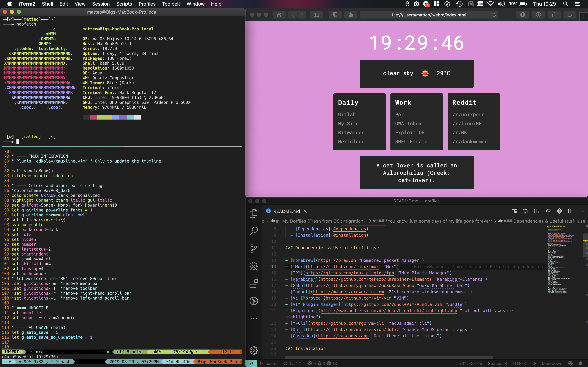

# `My Dotfiles (Fresh from OSx migration)` 

## *You know, just some days of my life gone forever*  

### Table of contents

- [`My Dotfiles (Fresh from OSx migration)`](#my-dotfiles-fresh-from-osx-migration)
  - [*You know, just some days of my life gone forever*](#you-know-just-some-days-of-my-life-gone-forever)
    - [Table of contents](#table-of-contents)
    - [Dependencies & Useful stuff i use](#dependencies--useful-stuff-i-use)
    - [Installation](#installation)
    - [Karabiner Shortcuts](#karabiner-shortcuts)
  - [System shortcuts (Mostly used to freeup some combos)](#system-shortcuts-mostly-used-to-freeup-some-combos)

### Dependencies & Useful stuff i use

- [Homebrew](https://brew.sh "Homebrew packet manager")
- [TMux](https://github.com/tmux/tmux "TMux")
- [TPM](https://github.com/tmux-plugins/tpm "TMux Plugin Manager")
- [Karabiner](https://github.com/tekezo/Karabiner-Elements "Karabiner-Elements")
- [Goku](https://github.com/yqrashawn/GokuRakuJoudo "Goku Karabiner DSL")
- [Magnet](https://magnet.crowdcafe.com "21st century windows management")
- [Vi IMproved](https://github.com/vim/vim "VIM")
- [VIM Plugin Manager](https://github.com/VundleVim/Vundle.vim "Vundle")
- [Highlight](http://www.andre-simon.de/doku/highlight/highlight.php "cat but with awesome highlighting")
- [M-Cli](https://github.com/rgcr/m-cli "MacOs admin cli")
- [Duti](https://github.com/moretension/duti/ "Change MacOS default apps")
- [Cascadea](https://cascadea.app "Dark theme all the things")
- [MuPDF](https://mupdf.com "Lightweight PDF reader")

### Installation

- Satisfy every aforementioned dependency
- Backup any conflicting dotfile in your home directory
- `git clone https://gitlab.com/MatteoManzoni/dotfiles.git ~/`
- If everything is setup correctly login and logout
- Enjoy

### Karabiner Shortcuts

| Key           | Do            |
| ------------- |:-------------:|
| CapsLock      | Left Ctrl     |
| Command T | Open Term |
| Command S | Open Safari |
| Command C | Open VSCode |
| Command F | Open Reeder |
| Command E | Open Mail |
| Command \ | Open Bitwarden |
| Command W | Open Calendar |
| Command A | Open Contacts |
| Command / | Open Telegram |
| Command N | Open Notes |
| Command H | Open Shortcut file |
| Command Shift H | Open dotfile README |
| Command ' | Open Slack |
| Command ] | Open Textual |
| Ctrl C | Copy |
| Ctrl V | Paste |
| Ctrl Shift C | Copy in terminal applications |
| Ctrl Shift V | Paste in terminal applications |
| Ctrl Shift X | Cut in terminal applications |
| Ctrl X | Cut |
| Ctrl S | Save |
| Ctrl Z | Undo |
| Ctrl Shift Z | Redo |
| Home | Beginning of the line |
| End | End of the line |
| F5 | Reload but not in debuggers |
| Ctrl R | Reload |
| Ctrl A | Select All |
| Ctrl T | New Tab |
| Ctrl Shift T | Reopen last closed tab |
| Ctrl F | Find |
| Ctrl O | Open |
| Ctrl N | New |
| Ctrl Shift N | New with modifier |
| Ctrl B/I/U | Switch to Bold/Italic/Underlien |
| Ctrl Q | Quit Program |
| Ctrl H | Hide Window |
| Ctrl W | Close Window |
| Command L | Lock Session |
| PrintScreen | Full Screen Screenshot |
| Shift PrintScreen | Selection Screenshot |
| Ctrl L | Browse open location |
| Option <- | Back |
| Option -> | Forward |
| Ctrl Delete | Delete no confirm |
| Ctrl + | Browser zoom + |
| Ctrl - | Browser zoom - |
| Command -> | Snap Right |
| Command <- | Snap Left |
| Command Return | Current window full screen (Hypervisors too) |
| Command Backspace | Restore current window (Hypervisors use Command Return again) |
| Command -> | Snap Right |
| Ctrl P | Print |
| Command P | Preferences |
| Ctrl Shift D | Add bookmark |
| Ctrl D | Show bookmarks panel |
| Command D | Show Desktop |
| Ctrl Option D | Add to reading list |
| Ctrl Option | Ungrab input from guest |

## System shortcuts (Mostly used to freeup some combos)

| Key           | Do            |
| ------------- |:-------------:|
| Ctrl Shift Command D | Mission Control -> Show Desktop |
| Ctrl Option Command . | Mission Control -> Move right a space |
| Ctrl Option Command , | Mission Control -> Move left a space |
| Ctrl Command P | App Shortcuts -> Print |
| Opt Shift Command D | App Shortcut -> Hide Bookmarks |
| Opt Shift Command D | App Shortcut -> Show Bookmarks |
